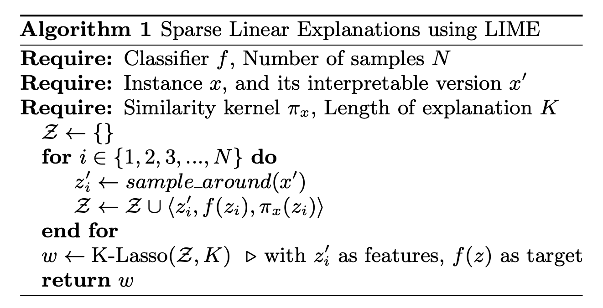
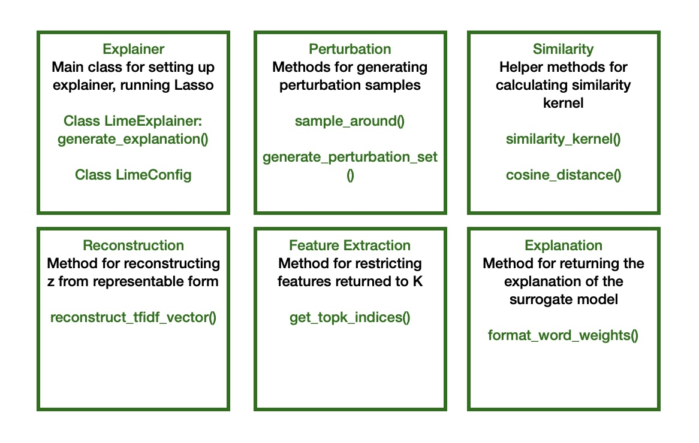

## Intro

In this post I will be exploring implementing the LIME Text Explainer from scratch, using the original LIME paper as a reference[1]

LIME broadly involves the following steps:
1. Train a non-interpretable base model (here we will use SVC - Support Vector Classifier) on the original dataset
2. Generate a new dataset by perturbing (slightly changing) the instances from the original dataset
3. Train an interpretable model on the new dataset (Usually Lasso or Ridge is used as surrogate model)

The above steps are formalised in the paper by the following algorithm:


The weights of the interpretable model become the feature explanations, ie. how much each feature contributes to the prediction of the non-interpretable model

LIME parameters:
Kernel width/similarity kernel
Top features to use, K

## Text Explanations

Using LIME with text is more complicated than for tabular data.
First raw text data should be vectorised (is there any ml model that doesnt require this?)
And turned into interpretable representation 
The LIME paper suggests binary bag-of-words vector for text classification, indicating the presence or absence of each word in the dataset vocabulary. 
TFidfVectorizer is used here because it tokenizes standalone words. 


## Setup

First I preparing the training and test data sets.

```python
# Get train data
categories = ['rec.sport.hockey', 'sci.med']  # choose 2 for simplicity
train_data = fetch_20newsgroups(subset='train', categories=categories, remove=('headers', 'footers', 'quotes'))
train_texts = train_data.data
train_labels = train_data.target

# Get test data
test_data = fetch_20newsgroups(subset='train', categories=categories, remove=('headers', 'footers', 'quotes'))
test_texts = test_data.data
test_labels = test_data.target
```

Next I create the TF-IDF vectorizer and SVC model using scikit learn library. The vectorizer does the following things:
1. First each entry in the training data is tokenized 
2. Then `fit` builds a vocabulary dictionary of all unique tokens
3. Finally `transform` computes TF-IDF scores for each word, and outputs a sparse matrix (sparse = most entries are 0) with one vector row per entry in the dataset, where the columns are the words in the vocabulary built in step 2


```python
# Create vectorizer and classifier, fit on training data
vectorizer = TfidfVectorizer(lowercase=False)
X = vectorizer.fit_transform(train_texts)
clf = SVC(kernel='rbf', gamma='scale', C=1.0, probability=True).fit(X, train_labels)
```

## Implementation of LIME Text Explainer



1. generate_explanation()
2. get_topk_indices()
3. generate_perturbation_set()
4. sample_around()
5. reconstruct_tfidf_vector()
6. similarity_kernel() + cosine_distance()
7. format_word_weights()

## Next Steps
Implementing submodular pick
- algorithm for deciding how many instances should be explained

## References

[1] Lime Paper