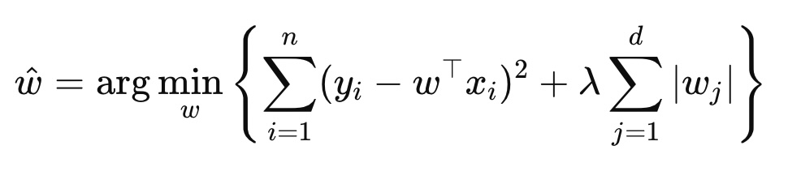

## Intro

In this post I will be exploring implementing the LIME Text Explainer from scratch, using the original LIME paper as a reference[1]

LIME broadly involves the following steps:
1. Train a non-interpretable base model (here we will use SVC - Support Vector Classifier) on the original dataset
2. Generate a new dataset by perturbing (slightly changing) the instances from the original dataset
3. Train an interpretable model on the new dataset (Usually Lasso or Ridge is used as surrogate model)

The above steps are formalised in the paper by the following algorithm:


The weights of the interpretable model become the feature explanations, ie. how much each feature contributes to the prediction of the non-interpretable model

LIME defines two parameters which are chosen heuristically:
1. Kernel width/similarity kernel - this is a function used to weight perturbed points based on the distance from the data point being explained
2. Top features to use, K - this limits the number of features to explain, improving interpretability of the explanation


## Core Idea of LIME

LIME brought many important new ideas to the field of XAI:

1. It is a Model-agnostic method, which means it can be applied to any classifier to explain its predictions. Interpretability in ML was largely up until this point reliant on inherently interpretable models like decision trees and rule based models.

2. It simplifies explaining complex black-box models by arguing local explanations are sufficient for interpreting a global model, via the use of a local surrogate linear model. A complex model may be highly nonlinear globally, but in a small neighborhood around a specific input, its behavior can often be approximated well by the simpler linear model
local approach

3. It focuses on human-centric interpretability, via the use of interpretable representations of features, which also makes it applicable to many use cases (tabular data, images, text)

 

###  LIME for Text Explanations

Using LIME with text data requires a few more preparation steps than for tabular data and has several other differences:

- First raw text data should be vectorised (Commonly TFidfVectorizer is used because it tokenizes standalone words)
- Second, we need to convert text to an interpretable representation. With tabular data, the features can be used directly, but for text data, the LIME paper suggests binary bag-of-words vector for text classification, indicating the presence or absence of each word in the dataset vocabulary. 
- Thirdly we perturb the examples. Instead of tweaking numerical values by a certain amount or randomly selecting one of the options for a categorical variable, we randomly remove some of the words.
- Finally, when we output our explanation, we show the user the top k words which had the largest positive or negative impact on the prediction


## Setup

In my re-implementation I focus on a classification problem, predicting whether excerpts of text are from the hockey sport category or medical science category.

First I prepare the training and test data sets.

```python
# Get train data
categories = ['rec.sport.hockey', 'sci.med']  # choose 2 for simplicity
train_data = fetch_20newsgroups(subset='train', categories=categories, remove=('headers', 'footers', 'quotes'))
train_texts = train_data.data
train_labels = train_data.target

# Get test data
test_data = fetch_20newsgroups(subset='train', categories=categories, remove=('headers', 'footers', 'quotes'))
test_texts = test_data.data
test_labels = test_data.target
```

Next I create the TF-IDF vectorizer and SVC model using scikit learn library. The vectorizer does the following things:
1. First each entry in the training data is tokenized 
2. Then `fit` builds a vocabulary dictionary of all unique tokens
3. Finally `transform` computes TF-IDF scores for each word, and outputs a sparse matrix (sparse = most entries are 0) with one vector row per entry in the dataset, where the columns are the words in the vocabulary built in step 2


```python
# Create vectorizer and classifier, fit on training data
vectorizer = TfidfVectorizer(lowercase=False)
X = vectorizer.fit_transform(train_texts)
clf = SVC(kernel='rbf', gamma='scale', C=1.0, probability=True).fit(X, train_labels)
```

## Implementation of LIME Text Explainer

An overview of the classes and methods in my code is shown below.


1. generate_explanation()
2. get_topk_indices()
3. generate_perturbation_set()
4. sample_around()
5. reconstruct_tfidf_vector()
6. similarity_kernel() + cosine_distance()
7. format_word_weights()

## Data Perturbation

### generate_perturbation method 
The generate_perturbation method takes the vectorised form of a sample data point x. Vectorised form means the raw text has been converted into a vector where each dimension of the vector corresponds to a word in the overall vocabulary.
The value at each position reflects how important that word is to the specific document, based on:
- how frequently the word appears in that document (Term Frequency), and
- how rare it is across the entire dataset (Inverse Document Frequency).

The method generates the desired number of perturbations (set with num_samples), generating 
1. z_binary, a perturbed sample point in representable binary format


```python
def generate_perturbation_set(self, xdash: csr_matrix) -> Tuple[np.ndarray, np.ndarray, np.ndarray]:
        """For each instance xdash, generate num_samples set of three:
            1. z_binary, a perturbed sample point in representable binary format,
            2. z_dense, a reconstruction of the z binary interpretable format in tfidf vectorized form
            3. Sample weights 

        Args:
            xdash (float): The tf-idf vectorized form of x
        
        Returns:
            array of floats: The coefficients of the trained surrogate k-lasso model.
        """
        Z_binary = [] 
        Z_dense = [] 
        sample_weights = []

        for i in range(self.config.num_samples):
            if i%100==0:
                print(f"Completed {i} samples")

            z_binary = perturbation.sample_around(xdash)
            z_dense = reconstruction.reconstruct_tfidf_vector(z_binary, xdash, self.topk_indices)
            weight = similarity.similarity_kernel(self.distance_func, xdash.toarray().flatten(), z_dense, self.config.width)

            Z_binary.append(z_binary)
            Z_dense.append(z_dense)
            sample_weights.append(weight)
        
        return Z_binary, Z_dense, sample_weights
```

## Kernel Function for Proximity Weighting

In the generate_perturbation function we also generate sample_weights from the kernel function. This assigns a weight to each perturbed data point based on how far it is from the original point - lower weights for further away points. In this way we penalise sampled points if they are very different from the original point.

```python
weight = similarity.similarity_kernel(self.distance_func, xdash.toarray().flatten(), z_dense, self.config.width)
sample_weights.append(weight)
```

## Interpretable Representations
When we generate the perturbations, we also generate an interpretable version Z binary. For our NLP use case the original LIME paper suggests a binary bag-of-words representation, ie. a vector of 0s for absence and 1s for presence of a word in the original raw text.

The purpose of the interpretable representation is to make the features and perturbation human-interpretable. We can then reason that a prediction was made to the presence of specific words. If we perturbed the values of the original TF-IDF vector it would be difficult to interpret what those changes actually represent in the underlying text — such as which word was added, removed, or emphasized. The interpretable representation ensures that the surrogate model provides explanations in terms of concrete, understandable features like specific words, rather than abstract vector manipulations.

We then later need to recreate the TF IDF vector of our Z binary, which happens in reconstruct_tfidf_vector method. I call this Z dense. 

```python
def reconstruct_tfidf_vector(z_binary: np.ndarray, xdash: csr_matrix, topk_indices: np.ndarray) -> np.ndarray:
    """Reconstruct the tf-idf vectorized form for perturbed sample z from its interpretable representation

            Args:
            z_binary (np.ndarray): The interpretable representation of perturbed samples z, an array of 0s and 1s
                indicating absence/presence of each word
            x_dash (csr_matrix): The tf-idf vectorized form of x
        
        Returns:
            array of floats: The coefficients of the trained surrogate k-lasso model.
    """
    x_dense = xdash.toarray().flatten()
    z_reconstructed = np.zeros(xdash.shape[1])
    z_reconstructed[topk_indices] = z_binary[topk_indices] * x_dense[topk_indices]
    return z_reconstructed
```
We then use pass Z dense to our base model and make a prediction (note that Z dense is vector containing the TF-IDF representation of all the perturbations)
```python
# (LimeExplainer.generate_explanation method)
y_pred = classifier.predict_proba(Z_dense)[:, 1]
```

## Surrogate Model Fitting (LASSO)

Next we take y_pred (the prediction we just made using Z_dense), Z_binary the interpretable representation of our features, and the sample_weights obtained from the kernel function, and pass it to our local surrogate model. The local surrogate model tries to do the following mapping:


Following the original LIME paper I use LASSO as surrogate model. LASSO is a linear regression model that balances two goals of minimizing squared error and keeping the model sparse and thus interpretable by shrinking some coefficients to zero. 

### LASSO equation



```python
# (LimeExplainer.generate_explanation method)
self.k_lasso.fit(Z_binary, y_pred, lasso__sample_weight=sample_weights)
```


## Explanation Generation Process

Finally the explanation results of running LASSO are returned to the user. In this case it is the words with the highest absolute value of coefficients. These are the words which contributed most to the classification prediction (hockey or medicine)

```python
def format_word_weights(coef, feature_names, topk_indices) -> List[Tuple[str, float]]:
    # Find indices of non-zero coefficients
    nonzero_coef_indices = np.flatnonzero(coef)

    # Get (feature name, coefficient) pairs
    nonzero_feature_weights = [(feature_names[i], coef[i]) for i in nonzero_coef_indices]

    # Sort by absolute value
    sorted_feature_weights = sorted(nonzero_feature_weights, key=lambda x: abs(x[1]), reverse=True)

    return sorted_feature_weights
```

## Example outputs

Data point to be explained
```
I had allergy shots for about four years starting as a sophomore in high
school.  Before that, I used to get bloody noses, nighttime asthma attacks,
and eyes so itchy I couldn't get to sleep.  After about 6 months on the
shots, most of those symptoms were gone, and they haven't come back.  I
stopped getting the shots (due more to laziness than planning) in college.
My allergies got a little worse after that, but are still nowhere near as
bad as they used to be.  So yes, the shots do work.
```

Classifier prediction results and actual result 
```
Prediction:  sci.med
Actual:  sci.med
```

Output of the text explainer when K=10. Larger positive values mean the word contributed to the sci.med prediction. Larger positive values indicate that the word contributes to the prediction of sci.med. Larger negative values indicate that the word pushes the prediction away from sci.med, i.e., toward sport.hockey in this binary classification setting.
```
to: 0.0430
the: -0.0329
about: 0.0311
used: 0.0277
of: 0.0221
and: 0.0188
work: 0.0168
they: -0.0161
My: 0.0140
sleep: 0.0140
```

The result is polluted with stopwords like 'to' and 'the', which ideally we don't want to be included in the model because it means the model is relying on spurious features. Ways to improve this are listed in 'Possible next steps' section, and include removing these words in pre-processing stage.

## Possible next Steps
- Implementing submodular pick (algorithm for deciding how many instances should be explained)
- Improving the text explainer by removing stopwords, making all lower case, trying RIDGE instead of LASSO, experimenting with different kernel widths and values for top-k

## References

[1] Ribeiro, M. T., Singh, S., & Guestrin, C. (2016).
"Why Should I Trust You?: Explaining the Predictions of Any Classifier."
Proceedings of the 22nd ACM SIGKDD International Conference on Knowledge Discovery and Data Mining (KDD '16), pp. 1135–1144.
https://doi.org/10.1145/2939672.2939778
